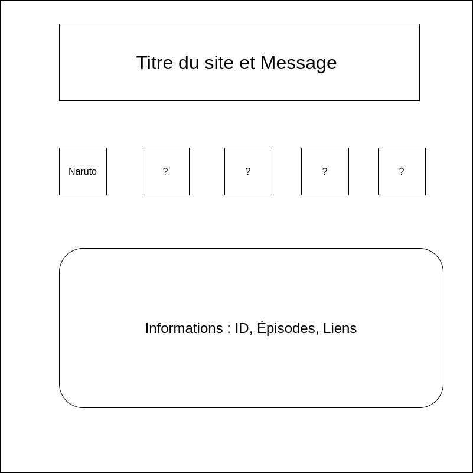

# Documentation officiel - MyAnimeProject

## Cas d'utilisation
Cette application permet de rechercher un anime simplement à l'aide d'une barre de recherche type "Google".
Elle vas requêter l'api "Jikan" qui est une api mangas / animes libre service afin de réaliser des projets tel que celui-ici. 
La recherche vas nous renvoyer des images correspondantes à l'anime ainsi qu'un synopsis (résumé) et à l'aide de liens liés aux images,
on à accés à la page "myanimelist" de l'oeuvre qui permet d'avoir accés à des commentaires utilisateurs, une note globale etc.
## Prototypage de l'application 

